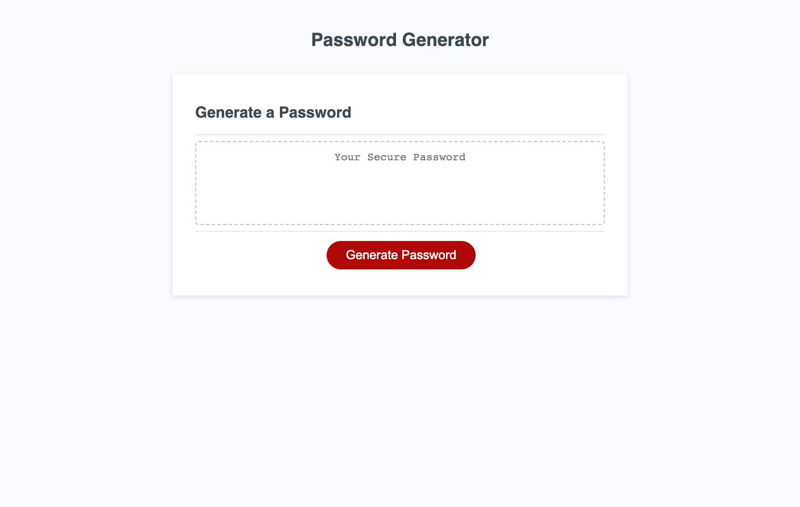

# JavaScript-pwgenerator

## Description

Created a random password generator using JavaScript. Allows user to choose a password length between 8-128 characters. User can choose to include numbers, lower/uppercase letters, and special characters. The result is then displayed in the text box.

## Screenshot

## Link to Application

This site was built using [GitHub Pages](https://ryan-m-taylor.github.io/JavaScript-pwgenerator/)